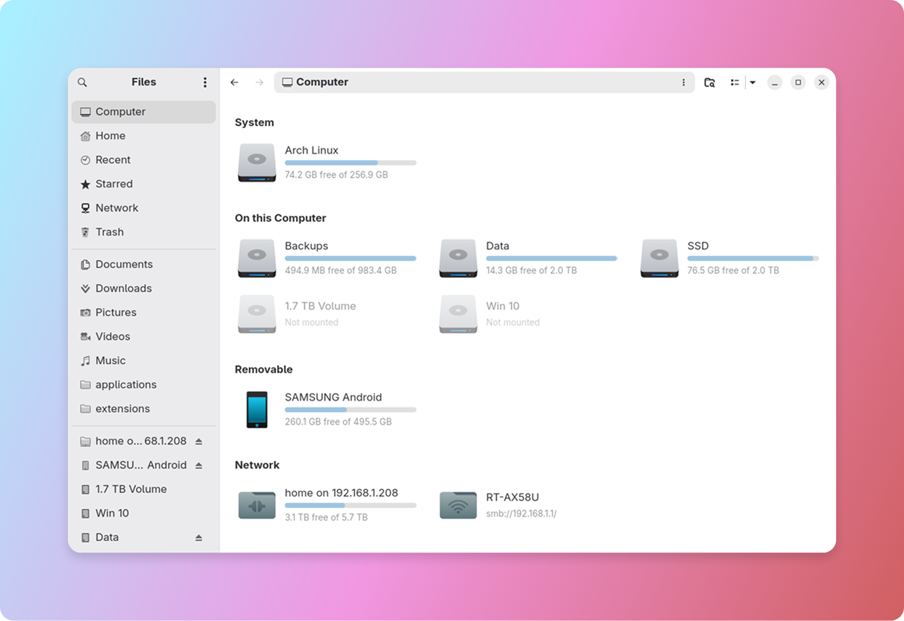
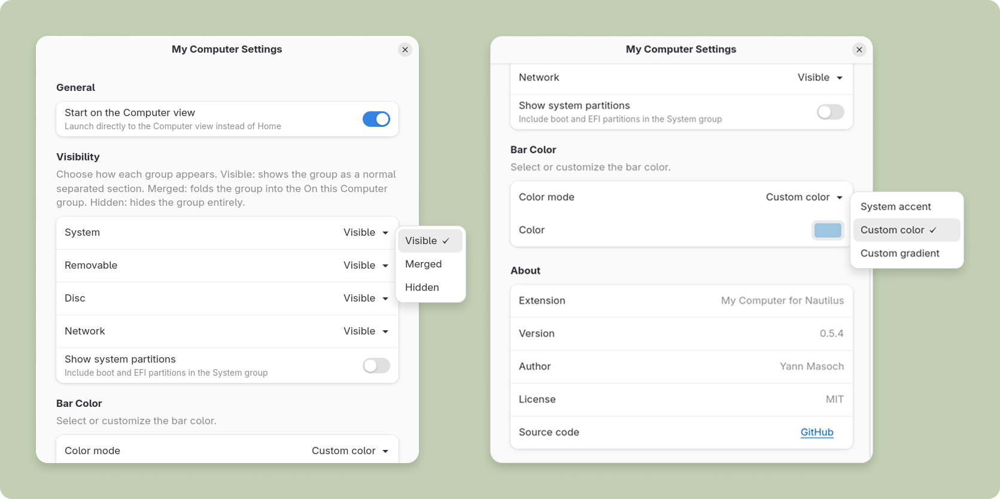
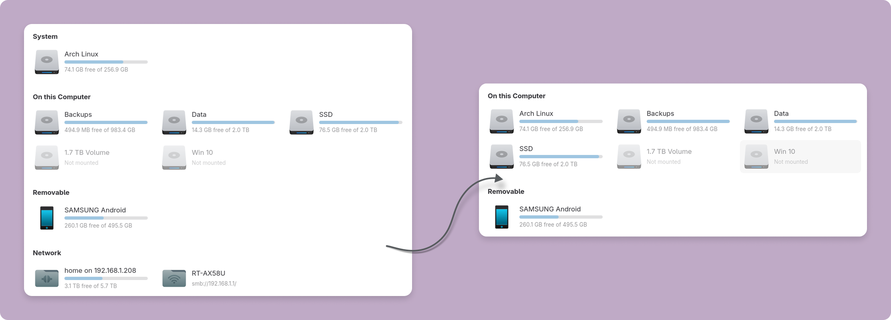
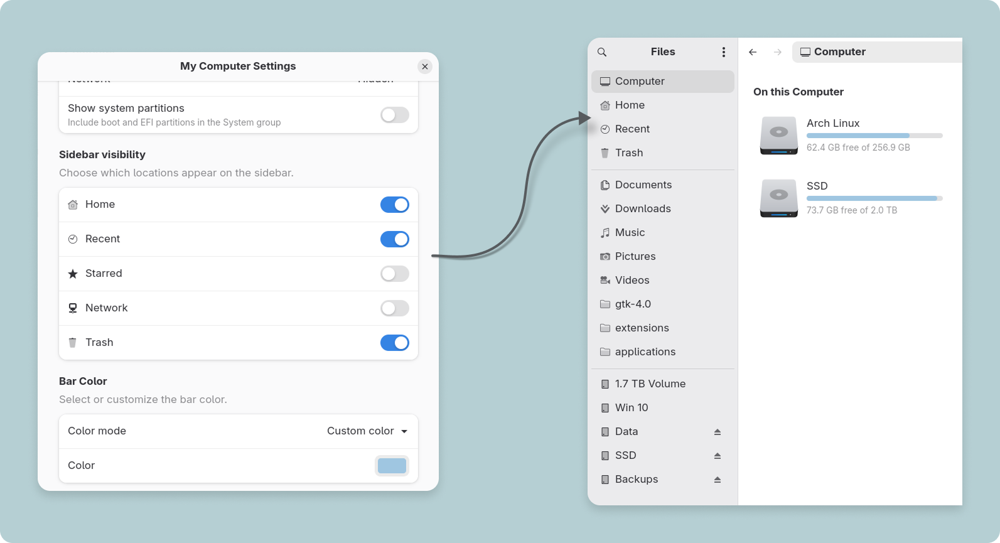
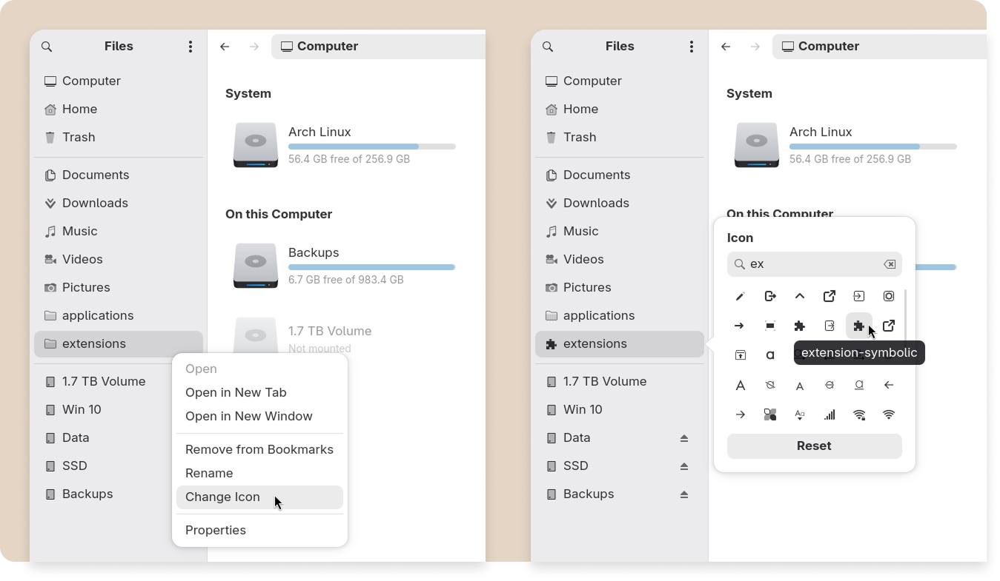
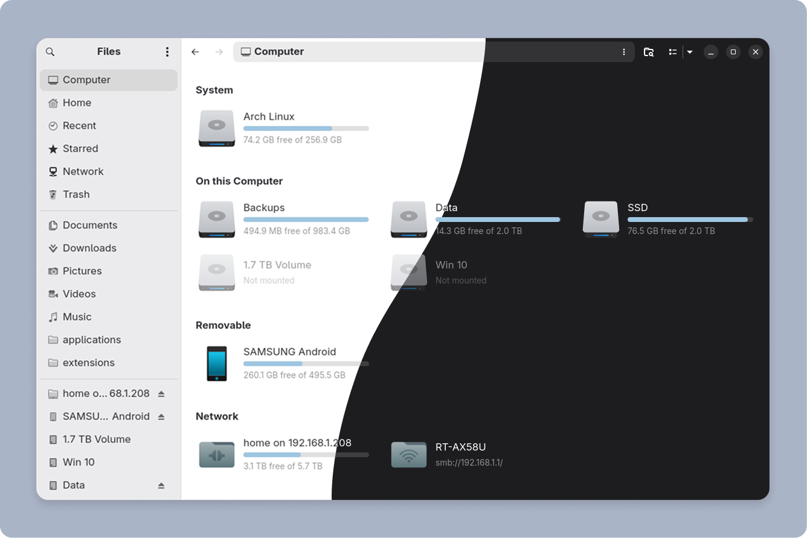

<div align="center">

# My Computer for Nautilus

<br>



<br>

**My Computer** is a custom view for GNOME Files (Nautilus), showing all your drives, volumes, and network mounts with usage levels in one clean panel.

*"GNOME dropped the Other Locations view and left nothing in its place. I built what should have always been there, and the GNOME community made it even better with ❤️"*

</div>

## Installation

### Install
```bash
curl -fsSL https://raw.githubusercontent.com/yannmasoch/nautilus-my-computer/main/install.sh | sh
```

### Uninstall
```bash
curl -fsSL https://raw.githubusercontent.com/yannmasoch/nautilus-my-computer/main/install.sh | sh -s -- --uninstall
```

Nothing is written outside your home directory.

## My Computer

### Sidebar integration

Computer sits at the top of the GNOME Files sidebar, click to open the panel and right-click for settings.


### Settings page

My Computer Settings let you:

- Open GNOME Files directly on the Computer view at startup
- Show or hide system partitions (root, boot, EFI, swap)
- Control the visibility of each group: visible, hidden, or merged into On this Computer
- Choose which sidebar locations are shown: Home, Recent, Starred, Network, Trash
- Customize the disk usage bar color to match your style



> Settings are stored via GSettings under `io.github.yannmasoch.nautilus-my-computer` and persist across sessions.

## Groups visibility

My Computer organises your storage into five groups:

- **System** - root, boot, EFI, and swap partitions
- **On this Computer** - your internal drives and partitions
- **Removable** - USB drives, phones, cameras, and removable media
- **Disc** - optical drives and mounted ISO images
- **Network** - network shares and remote filesystems

Each group (except **On this Computer**) has three visibility settings, configurable from the right-click menu on the Computer button:

- **Visible** - shown as its own labelled section
- **Hidden** - removed from the panel entirely
- **Merged** - folded into **On this Computer**, keeping everything in one flat list

Make the **My Computer** view your own, and organize it to show only what matters to you.



## Sidebar visibility

The default GNOME Files sidebar shows every built-in location whether you use it or not. My Computer gives you the visibility control of each one, so you can keep only what you actually need.

- **Home**
- **Recent**
- **Starred**
- **Network**
- **Trash**

**Computer** is always shown, it's the whole point of the extension. Everything else is up to you, turn off what you never use and your sidebar stays short and clean.



### Custom bookmark icons

Right-click any bookmark in the sidebar and choose "Change icon" to pick a custom symbolic icon from a searchable picker. Your choice persists across Nautilus restarts.



## Style

### Color mode for disk usage bars

Disk usage is shown as a native `Gtk.LevelBar`. Three color modes are available in Settings.


- **Gnome Accent Color** follows your GNOME accent color automatically
- **Custom Color** a single custom color
- **Custom Gradient** a two-color custom gradient

### Light and dark mode

The panel follows GNOME's light/dark preference natively, with no extra configuration.



### GNOME icon themes

All icons are native GNOME icons. My Computer works with any custom icon theme.

### GNOME GTK themes

My Computer is compatible with almost all custom GTK themes.

## Features

- **All your storage in one place:** local drives, USB sticks, phones, network mounts, and removable media grouped by type.
- **Usage bars:** at-a-glance capacity for every mounted volume.
- **Mount & eject:** mount, unmount, and eject volumes directly from the panel without leaving Files.
- **Live refresh:** the panel updates automatically when drives are connected or disconnected.
- **Fully native:** follows your GNOME accent color, icon theme, and dark/light mode with no extra configuration.
- **Customizable bars:** choose between GNOME accent color, a custom color, or a custom gradient for the usage bars.
- **Start on My Computer:** choose to open GNOME Files directly on the My Computer panel every time.
- **Right-click context menu:** open, open in new tab, open in new window, mount, unmount, and eject volumes directly from a native-feel context menu.
- **Groups visibility:** choose which storage groups are visible, hidden, or merged into one flat list.
- **Sidebar visibility:** choose which sidebar locations are shown: Home, Recent, Starred, Network, and Trash.
- **Custom bookmark icons:** right-click any bookmark to pick a custom symbolic icon from a searchable picker, persisted across restarts.
  
## Tested on

| | Distro | GNOME Files | Status |
|---|--------|-------------|--------|
| ✅ | Arch | 50.2.2 | Fully working |
| ✅ | openSUSE Tumbleweed | 50.2.2 | Fully working |
| ✅ | Fedora 44 Workstation | 50.2.2 | Fully working |
| ✅ | Fedora 44 Workstation | 50.0 | Fully working |
| ✅ | Ubuntu 26.04 LTS | 50.0 | Fully working |
| ☑️ | Zorin OS 18 | 46.4 | Partial, background colors and the My Computer menu entry are not available (Zorin ships a customised build of GNOME Files). Will be improved in a future release |

> GNOME Files versions below 50 may have limited functionality. Full support targets GNOME Files 50+.

## Languages

My Computer is fully localised. The UI language is picked up automatically from your GNOME locale settings, no configuration required.

Both left-to-right (LTR) and right-to-left (RTL) layouts are supported. The panel mirrors its layout direction automatically when a RTL language is active.

| Language | Code | Direction |
|----------|------|-----------|
| English *(default)*| `en` | LTR |
| Arabic | `ar` | RTL |
| Catalan | `ca` | LTR |
| French | `fr` | LTR |
| German | `de` | LTR |
| Hungarian | `hu` | LTR |
| Italian | `it` | LTR |
| Korean | `ko` | LTR |
| Portuguese | `pt` | LTR |
| Russian | `ru` | LTR |
| Spanish | `es` | LTR |
| Turkish | `tr` | LTR |

Want to add your language? Contributions are welcome, open a PR with a new `.po` file under `po/`.

## About

GNOME Files has no public API for adding custom views anymore. **My Computer** injects itself directly into the Nautilus widget tree at runtime, something no other extension currently does.

This unconventional approach is what makes it feel truly native, but it also means the extension relies on internal Nautilus structures that are not guaranteed to stay stable across versions.

Some integration points can break when GNOME Files changes its internal layout, as seen on Zorin OS 18.

These weak points are known and documented. Each release consolidates them further toward stability.

The goal is for My Computer to feel indistinguishable from a built-in feature and to stay that way across GNOME updates.

## Contributors

My Computer is community-built. These people have shaped what it is today.

[](https://github.com/yannmasoch/nautilus-my-computer/graphs/contributors)

Want to contribute? Check out [CONTRIBUTING.md](CONTRIBUTING.md).

## For GNOME community

**My Computer** is built by the GNOME community with ❤️ and your feedback is important!

*“They did not know it was impossible, so they did it”* ― Jean Cocteau (1954)
